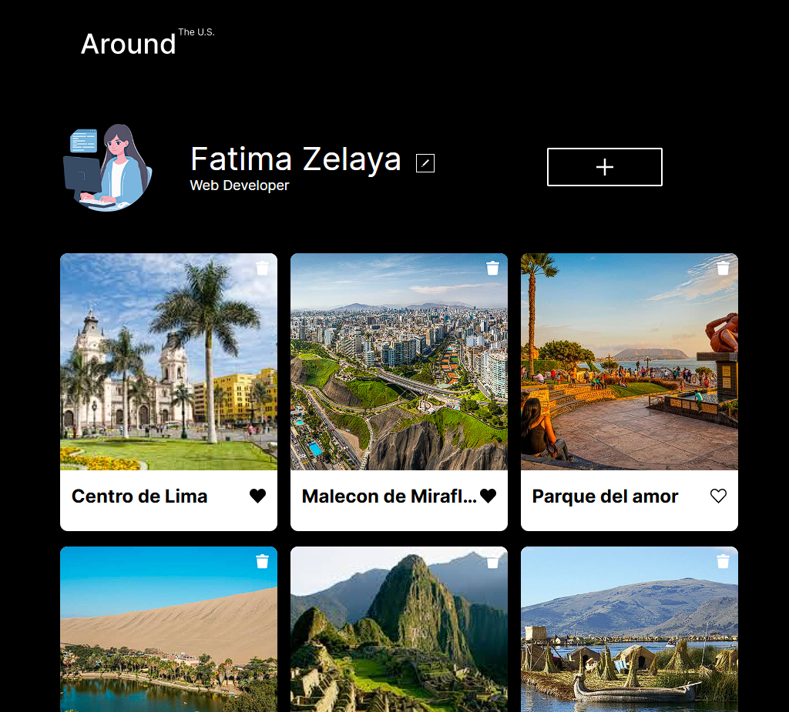
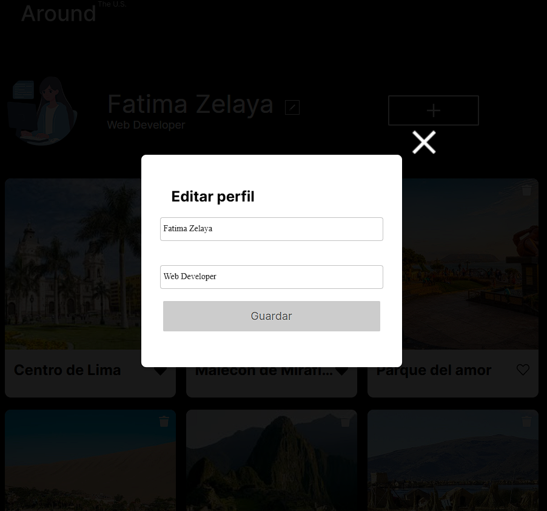

# Tripleten web_project_around Parte-1

## 1. Resumen del proyecto

**WEB PROJECT AROUND** es una pagina web interactiva como Instagram, donde el usuario va poder dar like y dislike a una foto, va poder agregar fotos, va poder cambiar el nombre de usuario y la foto de perfil. En esta primera parte, solo se hizo funcional la parte de la edicion del nombre de perfil y el hobbie o informacion extra de la persona que desee interactuar con la pagina.

### Prototipos de Alta Fidelidad:

Vista Principal de Alta fidelidad:

Cuadro emergente "Editar perfil":

## 5. Lenguajes y Herramientas Utilizadas

En el desarrollo de nuestro proyecto, hemos utilizado un lenguaje de programación y herramientas para garantizar su funcionalidad y diseño. A continuación, detallamos el principal lenguaje y herramientas que forman parte de nuestro proyecto:

### Herramientas de Programación

- **HTML Semántico:** Utilizado para estructurar y marcar nuestra página web de manera clara y accesible, definiendo la disposición y los elementos visuales de forma adecuada.

- **CSS Responsive:** Utilizado para diseñar y presentar la interfaz de manera que mejora la experiencia del usuario. Se han aplicado estilos, colores y diseños mediante media queries, flexbox y grid para asegurar una visualización óptima en diversos dispositivos y tamaños de pantalla.

### Lenguaje de Programación

- **JavaScript (JS):** Esencial para la interactividad y la funcionalidad dinámica de nuestra pagina web. Empleado para la manipulación del DOM con event listeners, y funciones que permiten acciones y comportamientos en tiempo real.

### Herramientas Adicionales

- **Control de Versiones (Git):** Esencial para el seguimiento eficiente de cambios en el código.
- **Prototipado y Diseño de Interfaz (Figma):** Utilizado para el prototipado y diseño de la interfaz, permitiendo la creación de maquetas visuales y la planificación de la experiencia de usuario. [Prototipo-figma](https://www.figma.com/design/vxxm1ZnAdQiBLoX7xYKY6g/Web_Brief_Sprint_5_ES-%7C-Alrededor-de-los-EEUU-%7C-desktop-%2B-mobile?node-id=9492-2&t=uBYQY8HCCu7kJEH1-1)
- **Visual Studio Code:** Se ha utilizado Visual Studio Code como entorno de desarrollo para la implementación del diseño y la gestión del código.

Este lenguaje y herramientas nos han permitido desarrollar una aplicación web completa y funcional, con un diseño atractivo y una experiencia de usuario optimizada. La combinación de HTML semántico, CSS responsive, JavaScript y herramientas como Git y Figma ha sido crucial para lograr un producto robusto, interactivo y de alta calidad.

## 6. Responsividad

**PROJECT AROUND** es completamente responsiva, adaptándose a diferentes resoluciones y dispositivos. Se han utilizado Media Queries, Flexbox y Grid para optimizar la visualización y la navegación en distintos dispositivos.

## Instrucciones de Uso

1. Clona el repositorio.
2. Abre los archivos `js, html, css` en tu navegador para explorar PROJECT AROUND.
3. Disfruta de la experiencia inmersiva y mira como se desarrollo el proyecto.

### Equipo de Diseño y Desarrollo

Este proyecto fue desarrollado por:

- [Franchesca Fatima Zelaya](https://github.com/FranchescaF)

Como parte de un proyecto práctico como estudiante de desarrollo web de TripleTen. Si tienes preguntas o comentarios, no dudes en ponerte en contacto al correo electrónico: fatimapolgar2001@gmail.com

## Visita la web:

- [Página Web](https://franchescaf.github.io/web_project_around/)
